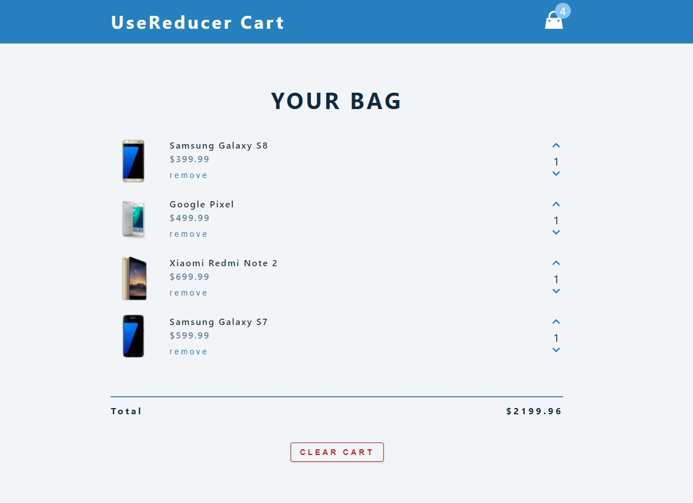

# React - Shopping Cart Component

[This project](https://gurhanalan.github.io/React-ShoppingCart-Component/) is a text shopping cart component. This component is build with using React.

## Table of contents

- [React - Shopping Cart Component](#react---shopping-cart-component)
  - [Table of contents](#table-of-contents)
  - [Overview](#overview)
    - [The challenge](#the-challenge)
    - [Screenshots](#screenshots)
    - [Links](#links)
  - [My process](#my-process)
    - [Built with](#built-with)

## Overview

### The challenge

Users should be able to:

<!-- -   View the optimal layout for the app depending on their device's screen size -->

-   Add items to the cart
-   Remove items from the cart
-   Change the item amounts in the cart

<!-- -   Change the position, color, shape and size of a box by click the control buttons. -->

### Screenshots

<!--   -->

 

<!--  -->

### Links

-   Solution URL: [Live Website](https://gurhanalan.github.io/React-ShoppingCart-Component/)

## My process

### Built with

-   React
-   Functional Components
-   CSS
-   React Hooks
